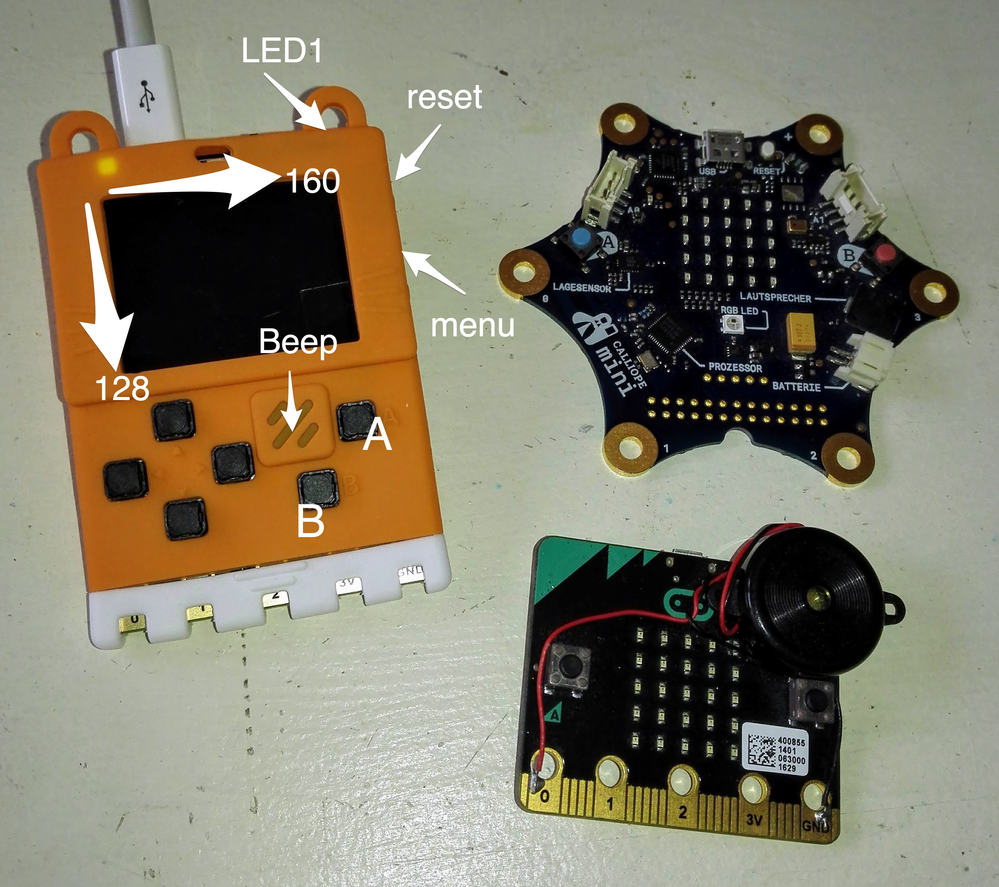
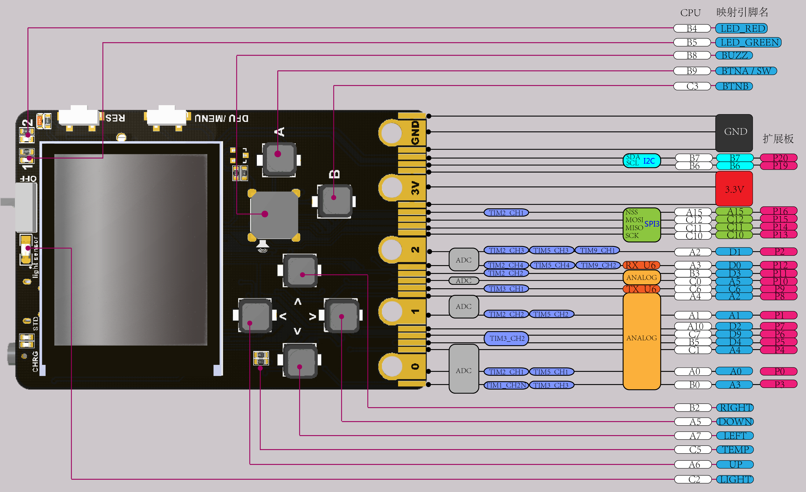
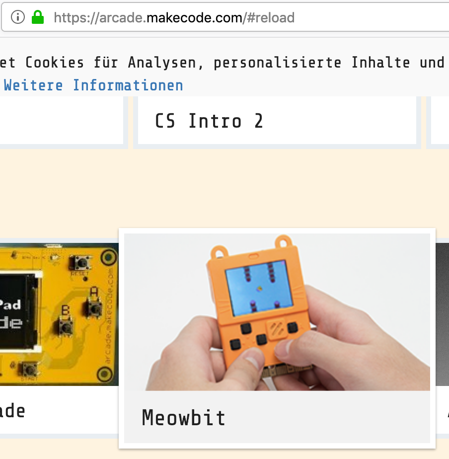
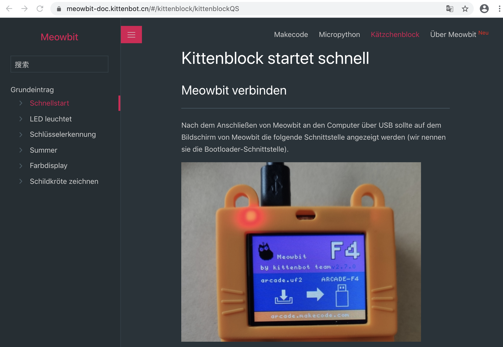
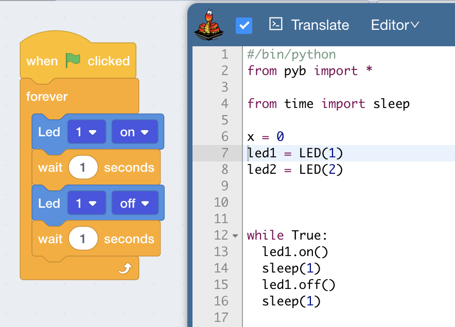
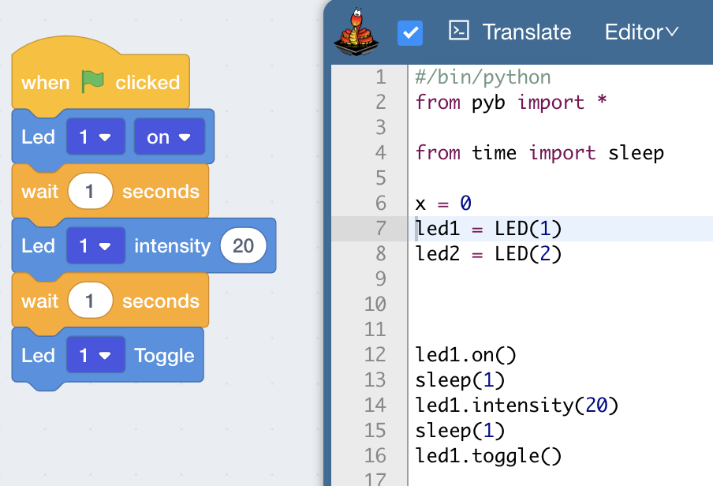
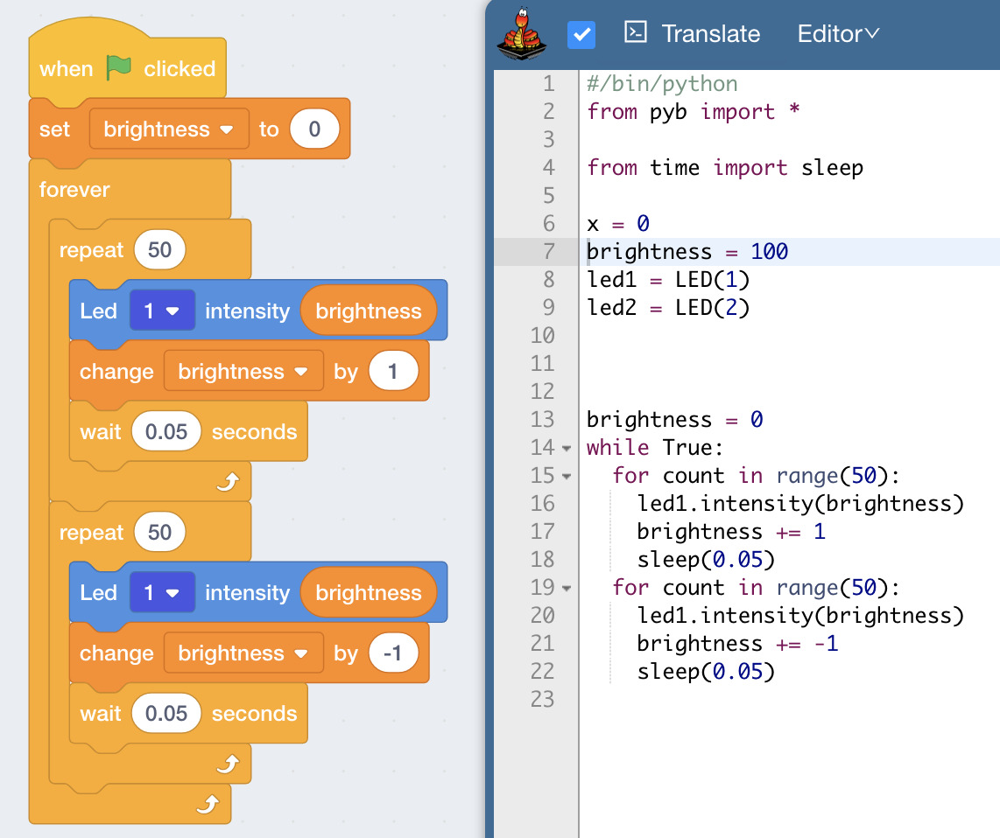

# Meowbit

Infos und Beispiele zum Meowbit von https://kittenbot.cn

Das [Meowbit](https://www.kittenbot.cc/collections/frontpage/products/meowbit-codable-console-for-microsoft-makecode-arcade) ist eine kleine Spielekonsole des chinesischen Herstellers Kittenbot. Du kannst es [auf Amazon kaufen](https://amzn.to/2R8b7Ja). Auch Adafruit [vertreibt es](https://blog.adafruit.com/2019/08/01/new-product-kittenbot-meowbit-codable-console-for-makecode-arcade/) seit August 2019.

Das Meowbit nutzt als Rechenkern einen STM32F401RET6, das ist ein 32-Bit-ARM-Cortex-M4-Prozessor ([Datenblatt](http://www.farnell.com/datasheets/1848998.pdf)). Darüber hinaus ist eine beeindruckende Menge an Hardware eingebaut:

* LED für Lade- / Arbeitsanzeige
* Lichtsensor
* Schiebeschalter zum Ein-/Ausschalten
* zwei programmierbare LED
* Reset-Taste
* DFU-Modus-Taste (auch zum Aufrufen des Menüs durch die Makecode-Firmware)
* 160 x 128 tft Farbbildschirm
* Temperaturfühler
* vier programmierbare Richtungstasten
* programmierbarer Summer
* zwei programmierbare Tasten A und B
* 40-Pin-Goldkontaktleiste, kompatibel zum micro:bit
* USB-Port zum Laden und Programmieren
* SD-Kartenslot (zum Speichern von Programmen und nachträglichen Erweitern um ein Bluetooth- oder WLAN-Modul)
* Klinkenbuchse zum Verbinden mehrerer Geräte (JacDac)
* 6-Achsen-Gyroskop und Beschleunigungsmesser
* 3,7 V Lithium-Batterie-Schnittstelle

Standardmäßig sind 2 MByte des SPI-Flash-Speichers mit einer Unicode-Zeichentabelle
belegt.

Hier ist die Pinbelegung der 40-poligen Steckerleiste (Stand: 2020-01-18. [Original](https://meowbit-doc.kittenbot.cn/#/more/intro)):

Das Meowbit kann auf drei Arten programmiert werden:

* https://arcade.makecode.com/ von Microsoft. Das Meowbit ist eine der offiziell unterstützten Spielekonsolen
  
  

* https://www.kittenbot.cc/pages/software von Kittenbot. Es gibt eine Variante namens Kittenblock von MIT Scratch mit MicroPython-Integration für Windows und macOS und eine angepasste Version des Mu-Editors, diesen leider nur für Windows.
* https://codewith.mu/en/download von Mu-Editor. Ich habe hiermit allerdings noch nicht geschafft, die REPL (Befehlszeile) auf dem Meowbit aufzurufen.

## Python mit Kittenblock

Das Meowbit ist eigentlich [sehr gut dokumentiert](https://meowbit-doc.kittenbot.cn/#/kittenblock/kittenblockQS), leider allerdings nur in Chinesisch. Hier hilft der Chrome-Browser mit seiner automatischen Übersetzungsfunktion.

Um die Hardware des Meowbit in MicroPython nutzen zu können, müssen einige Bibliotheken auf ddas PYBFLASH-Laufwerk gezogen werden. Diese Bibliotheken liegen im Ordner `Applications/Kittenblock.app/Contents/extensions/s3ext-meowbit`:

* buzz.py - für den Summer
* mpu6050.py - für das sechsachsige Gyroskop
* tft.py - für den Farbbildschirm
* turtle.py - für Zeichnungen mit Turtle-Grafik

## Bildschirm und Tasten

Der Bildschirm hat eine Auflösung von 160 (horizontal) und 128 (vertikal). Der Ursprung (Punkt 0,0) ist oben links. Die Bildschirmmitte liegt demnach bei (80, 64).

Der Code für die folgenden Beispiele liegt im `code/`-Unterverzeichnis.

## 01 Erster Test: 01 Blinkende LED

Hier ist ein erstes Programm zum Blinken der LED

## 02 Befehle für Leuchtdioden (LEDs) 

Dies sind die Befehle für die eine, grüne LED am Gerät oben rechts:

* led1.on()   # LED an
* led1.off()  # LED aus
* led1.toggle()      # LED umschalten
* led1.intensity(x)  # Helligkeit der LED

Hier ein weiteres Beispiel:

## 03 Atmende LED

Wie die Statusleuchte an Macs:

## 04 Tasten per Interrupt

Für gute Responsivität können die Tasten per Interrupt abgefragt werden. Einen passenden Block habe ich nicht gefunden (obwohl er in der [Originaldokumentation](https://meowbit-doc.kittenbot.cn/#/kittenblock/02%E6%8C%89%E9%94%AE%E6%A3%80%E6%B5%8B) abgebildet ist), aber [hier](code/04+keys.py) ist der Python-Code.

Ich habe in der Anleitung ein [komplexeres Beispiel](code/05+keys-intensity.sb3) inklusive der Blöcke gefunden:

